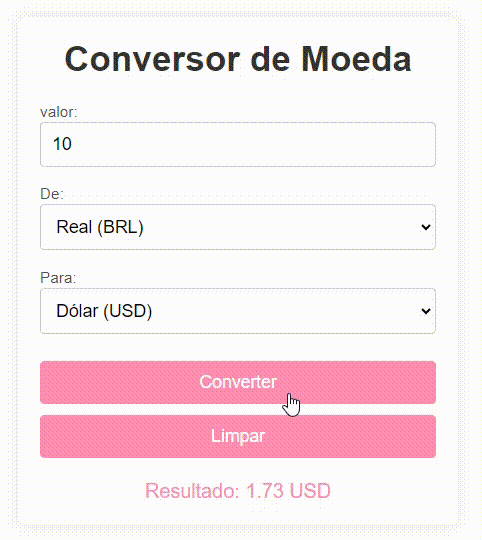

#  💫 Conversor de moeda API 💫

Este projeto é uma versão aprimorada do [Conversor de moeda](https://github.com/luamygama/Conversor-de-Moedas), oferecendo recursos avançados para realizar conversões de moeda de forma prática e precisa com dados atualizados em tempo real.

## 📋 Funcionalidades

- Atualização de Taxas em Tempo Real: Utiliza uma API de câmbio para obter as taxas de moedas mais recentes, eliminando a necessidade de atualizações manuais no codigo.

- Conversão Rápida entre Moedas: Realiza a conversão entre 3 tipos de moedas, permitindo que o usuário selecione a moeda de origem e a de destino.

- Tratamento de Erros: Informa o usuário em caso de problemas com a API ou entradas inválidas, oferecendo uma experiência mais fluida e robusta.

## ⚙️ Explicação dos Códigos Principais

- O projeto utiliza JavaScript para conectar-se à [ExchangeRate API](https://www.exchangerate-api.com/), obtendo taxas de câmbio atualizadas em tempo real. 

- Como cadastrar neste site? e simples! 

- Basta cadastrar um e-mail válido, e você receberá um e-mail de confirmação que dará acesso à sua chave de API.

- Configuração da API: Define a chave de autenticação e a URL da API para acessar as taxas de câmbio mais recentes.

- Função de Obtenção de Taxa de Câmbio: Realiza uma chamada à API, buscando a taxa de conversão entre as moedas selecionadas pelo usuário. Em caso de erro, exibe uma mensagem informativa.

- Processo de Conversão e Exibição: Captura o valor inserido e as moedas escolhidas, calcula o valor convertido com base na taxa de câmbio obtida e exibe o resultado na tela. Em caso de falha na conexão ou na resposta, informa o usuário

## 🚀 Tecnologias Utilizadas

- Linguagem: JavaScript
- API de Câmbio: ExchangeRate API para obter dados de câmbio atualizados.
- HTML e CSS: Interface simples para interação com o usuário.

## ☺️ Modo de Uso:

- Insira o valor, a moeda de origem e a moeda de destino.

- Clique em "Converter" para obter o valor convertido com base na taxa de câmbio mais recente.

## ❤️ Ilustração do projeto ❤️

# 🎉 linkedin
Este projeto será documentado no LinkedIn!

# *📝 Autoria:*
Este projeto é uma criação ´´[Luamy Alves Gama](https://www.linkedin.com/in/luamy-alves-gama-1398332b1/)´´ espero que tenha gostado!
